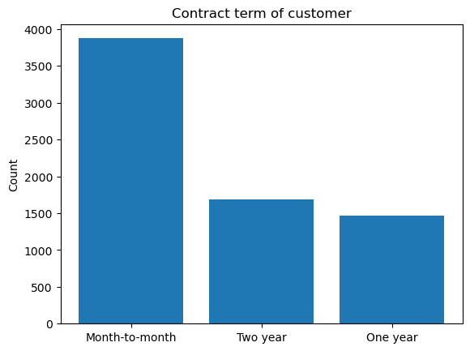

# Customer churn analysis

Customer churn analysis dataset can be found [here](https://www.kaggle.com/datasets/blastchar/telco-customer-churn?resource=download).

In this project, we explored the important variables that affect customer who left within the last month (Customer Churn). Logistic lasso regression and Decision tree models (Bagging, Random Forest, Boosting) were used for the inference analysis. Furthermore, customer churn was predicted by comparing the the accuracy, precision, recall, F1 score of the following models KNN, Decision Tree, Bagging Decision tree, Boosting Decision tree, Random Forest, Support Machine Vector (SVM), and Logistic Lasso regression.

### Data
Data set contains 7043 customers and 21 attributes which include:

Services that each customer has signed up for – phone, multiple lines, internet, online security, online backup, device protection, tech support, and streaming TV and movies

Customer account information – how long they’ve been a customer, contract, payment method, paperless billing, monthly charges, and total charges

Demographic info about customers – gender, age range, and if they have partners and dependents

Customers who left within the last month – Churn

The data set contains 10 null values which were remove for this analysis.

The plots below show descriptive for some of the variables. The tenure of customers plots show that there is a high number of customer who stop buying the product/service after one month. However there is also a large number of long lasting customer with a tenure of 70 months. Also customer prefer Month-to-month contracts then two years and finally follow up by one year. In this data set there is also more males than females. 

# Statistical Inference important predictors relating to churn customers

Four Decision tree models and Logistic Lasso regression were used to determined important predictors related to customer churning. For the trees models, the Gini index was used to determined important predictors. For the logistic model the odds ratio of the coefficients were used to determine the relationships.

The plots below show the top 10 important features for each of the decision tree models. Definitely `Contract_Month-to-Month` and `intenetService_Fiber` are important for customer churning since both have high average Gini decrease in all four tree models.

The logistic lasso regression model coefficients odds ratio is shown in the table below. The logistic model gives more information on how each variables relationship such as positive/negative and magnitude is towards the customer churn. From example for the `InterntService_Fiber optic` has an odds ratio od 2.3. Meaning, on average the odds of Churning customer increase by a factor of 2.3 comparing `InterntService_Fiber optic` to `InterntService_No` when all other variables are held fixed. The log odds ratio values that are negative decrease the the churn customers. Of course as `MonthlyCharges` increase by 10$ the odds of churn customer decrease by a factor of .29 (or 71%) when all other variables are held fixed. Variables that have log odds coefficient of zero is because Lasso regularization was performed for model selection.

# Predicting Churning Customer

The following models were used Logistic, SVM, Decision Tree, Bagging Decision tree, Random Forest, and Boosting Decision tree to determine customer churn. Cross validation (10-fold) was performed to determined the optimal model.

The no information rate for the testing data set is about  0.74 and prevalence is 0.26 (555/2100).

The figure below shows each of the model performance metrics. All 6 models performed well in predicting passenger satisfaction since the accuracy for all models is greater than the no information rate of 0.74. The decision tree model has the lowest metrics with an F1 score of 0.51. All model have very close performance metrics. The SVM model has the highest F1 score of 0.6  and balanced accuracy of 0.72.

The plot below show receiver operating characteristic curve (ROC) for each model. Again the Area under the Curve (AUC) for all model is greater than 0.81 meaning all model performed well in predicting churn customers. The logistic lasso regression model has the highest AUC with 0.848. However all models AUC are very close with each other.

Conclusion: After training the models using 10-fold cross validation, all models performed well in predicting churn customer. Overall the logistic lasso regression is the best classifier based on the ROC.

